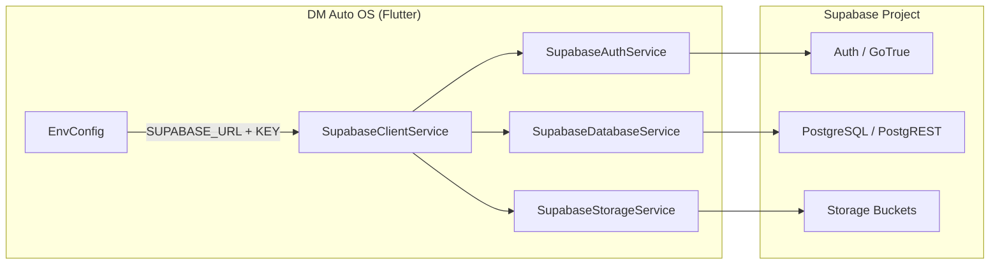

# DM Auto OS — Supabase Integration

This document describes how DM Auto OS connects to Supabase for **Authentication**, **PostgreSQL**, and **Storage**. All credentials are supplied via environment variables — nothing is hardcoded in the application.

| Variable | Required | Purpose |
|----------|----------|---------|
| `SUPABASE_URL` | Yes | Project URL (`https://<ref>.supabase.co`) |
| `SUPABASE_PUBLISHABLE_KEY` | Yes | Publishable (anon) key for client SDK |
| `SUPABASE_STORAGE_DOCUMENTS_BUCKET` | No | Default: `documents` |
| `SUPABASE_STORAGE_VEHICLE_PHOTOS_BUCKET` | No | Default: `vehicle-photos` |

**Credential placement:** [SETUP.md](../SETUP.md)  
**Production deployment:** [DEPLOYMENT.md](../DEPLOYMENT.md)  
**Database schema:** [supabase/README.md](../supabase/README.md)

---

## Architecture



### Service layer

| Service | File | Supabase product |
|---------|------|------------------|
| Client bootstrap | `lib/data/services/supabase_client_service.dart` | SDK init, PKCE auth, health check |
| Authentication | `lib/data/services/supabase_auth_service.dart` | GoTrue (email/password, sessions) |
| Database | `lib/data/services/supabase_database_service.dart` | PostgREST (PostgreSQL queries) |
| Storage | `lib/data/services/supabase_storage_service.dart` | Object storage (uploads, signed URLs) |
| Health check | `lib/data/services/supabase_health_check.dart` | Startup connectivity validation |

Riverpod providers in `lib/providers/supabase_provider.dart` expose these services to the UI.

---

## Environment configuration

`lib/core/config/env_config.dart` loads variables at compile time:

1. **`--dart-define` / `--dart-define-from-file`** (recommended for local and production)
2. **`assets/.env.example`** via flutter_dotenv (placeholder fallback → demo mode)

If real credentials are missing or contain placeholders, the app runs in **demo mode** without a Supabase connection.

### Local development

```bash
cp env.local.json.example env.local.json
# Edit with your Supabase project URL and publishable key

./scripts/run_dev.sh
```

### Production builds

```bash
cp env.production.json.example env.production.json
# Edit with production credentials

./scripts/build_web.sh
```

**Never commit** `env.local.json` or `env.production.json`. Both are gitignored.

---

## 1. Authentication

### App configuration

- **Flow:** PKCE (`AuthFlowType.pkce`) — secure for web and mobile
- **Auto-refresh:** Enabled
- **Methods:** Email/password sign-in, sign-out, password reset

### Supabase dashboard setup

1. **Authentication → Providers** — enable **Email**
2. **Authentication → URL Configuration**
   - **Site URL:** your production domain (e.g. `https://app.example.com`)
   - **Redirect URLs:**
     - Web: `https://app.example.com/**`
     - Mobile: `com.dmauto.dm_auto_os://login-callback/`
3. Create users via dashboard or invite flow
4. Assign roles in `public.profiles` (`administrator` or `employee`)

### Database integration

Migration `001_initial_schema.sql` creates:

- `public.profiles` linked to `auth.users`
- `handle_new_user()` trigger — auto-creates profile on signup
- `public.is_administrator()` helper for RLS

### Flutter usage

```dart
final auth = ref.read(supabaseAuthServiceProvider);
await auth.signInWithPassword(email: email, password: password);
```

---

## 2. PostgreSQL database

### Schema

Run migrations in order from `supabase/migrations/`:

| # | File | Contents |
|---|------|----------|
| 1 | `001_initial_schema.sql` | Core tables, profiles, RLS |
| 2 | `002_financial_operations_schema.sql` | Transactions, expenses, drivers, documents |
| 3 | `003_module_priorities.sql` | Period closing, cashbook/profitability views |
| 4 | `004_schema_grants_and_comments.sql` | Grants and index hardening |
| 5 | `005_storage_buckets.sql` | Storage buckets and storage RLS |

### Security

- **Row Level Security (RLS)** enabled on all business tables
- Soft deletes hide records from non-administrators
- Client uses the **publishable key** only — never the service role key
- Access control enforced at the database layer

### Flutter usage

```dart
final db = ref.read(supabaseDatabaseServiceProvider);
final row = await db.fetchById('vehicles', vehicleId);
```

---

## 3. Storage buckets

Migration `005_storage_buckets.sql` creates two **private** buckets:

| Bucket | Env override | Max size | MIME types |
|--------|--------------|----------|------------|
| `documents` | `SUPABASE_STORAGE_DOCUMENTS_BUCKET` | 50 MB | PDF, JPEG, PNG, WebP, Word |
| `vehicle-photos` | `SUPABASE_STORAGE_VEHICLE_PHOTOS_BUCKET` | 10 MB | JPEG, PNG, WebP |

### Path convention

Files are stored as `{entityType}/{entityId}/{fileName}` (see `StorageConstants.buildPath`).

### Access model

- Buckets are **private** — no public URLs
- Authenticated users can upload and read via RLS policies
- Downloads use **signed URLs** (`createSignedUrl`)
- Administrators can delete any file; users can delete their own uploads

### Flutter usage

```dart
final storage = ref.read(supabaseStorageServiceProvider);
final path = await storage.uploadDocument(
  entityType: 'rentals',
  entityId: rentalId,
  fileName: 'contract.pdf',
  bytes: fileBytes,
  contentType: 'application/pdf',
);
final url = await storage.createSignedUrl(
  bucket: 'documents',
  path: path,
);
```

---

## Startup health check

On launch, `SupabaseClientService` verifies connectivity:

1. Loads credentials from `EnvConfig`
2. Initializes the Supabase SDK
3. Pings `/auth/v1/health` and `/rest/v1/` with the publishable key
4. Sets `isConnected` only if both endpoints respond successfully

Check status in the app under **Settings → System → Supabase**.

---

## Local Supabase CLI (optional)

`supabase/config.toml` configures a local Supabase stack for development:

```bash
# Requires Supabase CLI: https://supabase.com/docs/guides/cli
supabase start
supabase db reset   # applies migrations locally
```

Point `env.local.json` at your local instance (`http://127.0.0.1:54321`) and use the local publishable key from `supabase status`.

---

## Security checklist

- [ ] Use separate Supabase projects for development and production
- [ ] Only `SUPABASE_PUBLISHABLE_KEY` in client builds — never the service role key
- [ ] Run all five SQL migrations before first use
- [ ] Confirm RLS policies in Supabase dashboard → Authentication → Policies
- [ ] Storage buckets remain private; use signed URLs for downloads
- [ ] Store production credentials in CI secrets, not in the repository
- [ ] Configure auth redirect URLs for every deployment domain

---

## Troubleshooting

| Symptom | Likely cause | Fix |
|---------|--------------|-----|
| Demo mode in Settings | Credentials not passed at build time | Use `--dart-define-from-file=env.local.json` |
| "Configured but not connected" | Invalid URL/key or project paused | Verify dashboard values; check health check message |
| Auth sign-in fails | Email provider disabled or user missing | Enable Email provider; create user in dashboard |
| Database permission denied | Migrations not applied or no session | Run migrations; sign in first |
| Storage upload fails | Bucket missing or RLS blocking | Run `005_storage_buckets.sql`; ensure authenticated session |

---

## Related files

| File | Purpose |
|------|---------|
| `env.local.json.example` | Local dev credential template |
| `env.production.json.example` | Production credential template |
| `assets/.env.example` | Placeholder fallback (demo mode) |
| `scripts/run_dev.sh` | Local run with env file |
| `scripts/build_web.sh` | Production web build with env file |
| `.github/workflows/ci.yml` | CI analyze, test, and build |
