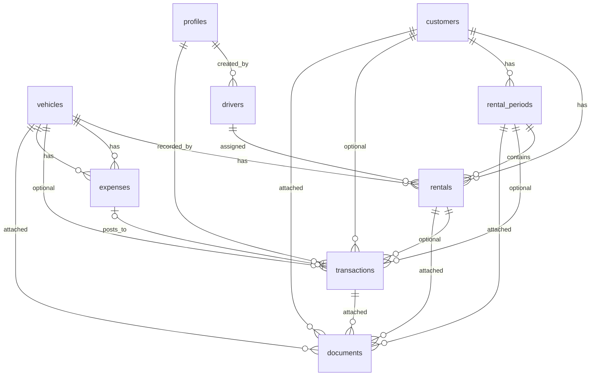

# DM Auto OS — PostgreSQL Schema

Primary currency: **XAF** (stored as `INTEGER`, no decimals)

## Migration order

Run these files **in order** in the Supabase SQL editor:

| # | File | Purpose |
|---|------|---------|
| 1 | `migrations/001_initial_schema.sql` | Core tables: profiles, vehicles, customers, rentals, service_orders, vehicle_sales |
| 2 | `migrations/002_financial_operations_schema.sql` | **drivers**, **rental_periods**, **transactions**, **expenses**, **documents**, **reports** + soft deletes + RLS |
| 3 | `migrations/003_module_priorities.sql` | Period closing, cashbook view, profitability view, optional workshop |
| 4 | `migrations/004_schema_grants_and_comments.sql` | Grants, comments, index hardening |
| 5 | `migrations/005_storage_buckets.sql` | Storage buckets + RLS policies |
| 6 | `migrations/006_cashbook_module.sql` | Multi-currency, daily/period summaries |

## Entity relationship diagram



## Requested tables

### `drivers`

| Column | Type | Notes |
|--------|------|-------|
| `id` | UUID PK | `uuid_generate_v4()` |
| `full_name`, `phone`, `license_number` | TEXT | Required |
| `license_expiry`, `status` | DATE / enum | `active`, `inactive`, `suspended` |
| Audit | | `created_at`, `updated_at`, `created_by`, `updated_by` |
| Soft delete | | `deleted_at`, `deleted_by` |

**Indexes:** status, license_expiry, full_name (partial: active only)

---

### `rental_periods`

| Column | Type | Notes |
|--------|------|-------|
| `id` | UUID PK | |
| `customer_id` | UUID FK → customers | Optional |
| `start_date`, `end_date` | DATE | `end_date >= start_date` |
| `status` | enum | `planned`, `active`, `completed`, `cancelled`, `closed` |
| `total_income_xaf`, `total_expense_xaf`, `net_balance_xaf` | INTEGER | Closing totals |
| `is_locked` | BOOLEAN | Set on close |
| Audit + soft delete | | Standard |

**Relationship:** `rentals.rental_period_id` → one period has many rentals

**Function:** `close_rental_period(uuid, text)` — locks period, writes `rental_period_closings`

---

### `transactions` (Cashbook)

| Column | Type | Notes |
|--------|------|-------|
| `id` | UUID PK | |
| `transaction_type` | enum | **`income`** or **`expense`** |
| `category` | enum | rental_payment, fuel, maintenance, etc. |
| `amount_xaf` | INTEGER | > 0 |
| `transaction_date` | DATE | |
| Optional FKs | | vehicle, customer, rental, rental_period, service_order, vehicle_sale |
| `is_cashbook_posted` | BOOLEAN | Default true |
| `cashbook_sequence` | BIGSERIAL | Ordering |
| Audit + soft delete | | Standard |

**View:** `cashbook_entries` — chronological ledger with `running_balance_xaf`

---

### `expenses`

| Column | Type | Notes |
|--------|------|-------|
| `id` | UUID PK | |
| `vehicle_id` | UUID FK → vehicles | **Required** — vehicle has many expenses |
| `transaction_id` | UUID FK → transactions | Optional unique link to ledger |
| `category` | enum | fuel, maintenance, repair, etc. |
| `amount_xaf` | INTEGER | > 0 |
| Audit + soft delete | | Standard |

---

### `documents`

Polymorphic attachment — **exactly one** parent via CHECK constraint:

| Parent FK | References |
|-----------|------------|
| `vehicle_id` | vehicles |
| `customer_id` | customers |
| `rental_id` | rentals |
| `transaction_id` | transactions |
| `rental_period_id` | rental_periods (closing reports) |

Storage path in `file_path` (Supabase Storage bucket).

---

### `reports`

| Column | Type | Notes |
|--------|------|-------|
| `id` | UUID PK | |
| `report_type` | enum | financial, fleet, rental, expense, revenue, custom |
| `status` | enum | draft → generating → generated / failed / archived |
| `parameters`, `summary` | JSONB | Report config and output |
| `period_start`, `period_end` | DATE | Optional range |
| `file_path` | TEXT | Generated export |
| Audit + soft delete | | Standard |

## Standard columns (all business tables)

Every table listed above includes:

```sql
id              UUID PRIMARY KEY DEFAULT uuid_generate_v4()
created_at      TIMESTAMPTZ NOT NULL DEFAULT NOW()
updated_at      TIMESTAMPTZ NOT NULL DEFAULT NOW()  -- auto via trigger
created_by      UUID REFERENCES profiles(id)         -- where applicable
updated_by      UUID REFERENCES profiles(id)         -- where applicable
deleted_at      TIMESTAMPTZ                          -- soft delete
deleted_by      UUID REFERENCES profiles(id)         -- soft delete audit
```

## Row Level Security

| Pattern | Who | Rule |
|---------|-----|------|
| Active records | All authenticated | `deleted_at IS NULL` |
| Deleted records | Administrators only | `deleted_at IS NOT NULL` |
| Insert | Authenticated | `deleted_at IS NULL` on create |
| Update active | Authenticated | `USING` and `WITH CHECK` require `deleted_at IS NULL` |
| Soft delete | Administrators | Can set `deleted_at` via UPDATE |
| Reports (own drafts) | Creator or admin | `created_by = auth.uid()` |

Helper function: `is_administrator()` — checks `profiles.role = 'administrator'`

## Views

| View | Purpose |
|------|---------|
| `cashbook_entries` | Income/expense entries with running XAF balance |
| `vehicle_profitability` | Per-vehicle rental income − vehicle expenses |

Both granted `SELECT` to `authenticated` (migration 004).

## Optional: Workshop

`service_orders` is retained but secondary. After migration 003, `vehicle_id` is **optional**.
